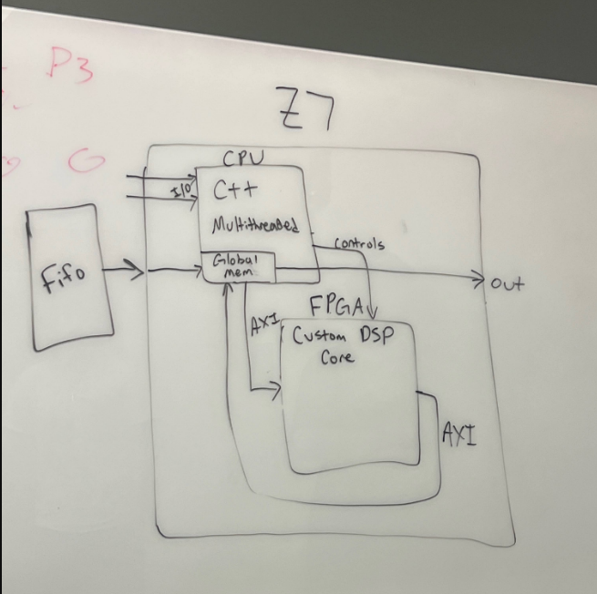
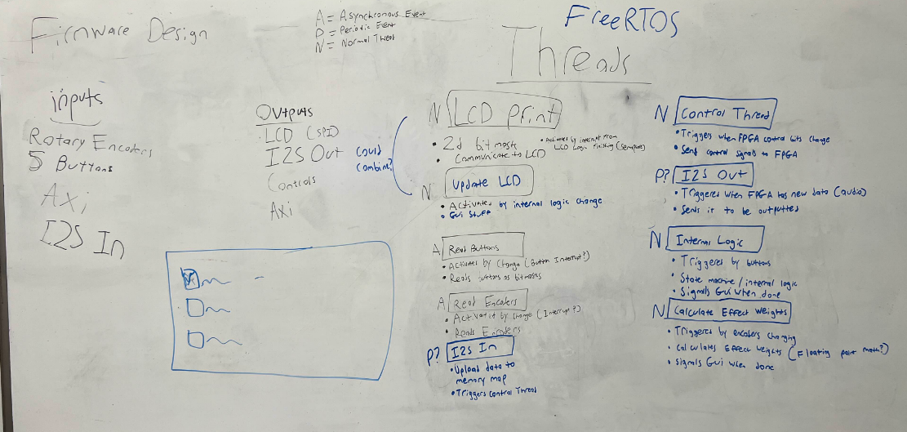
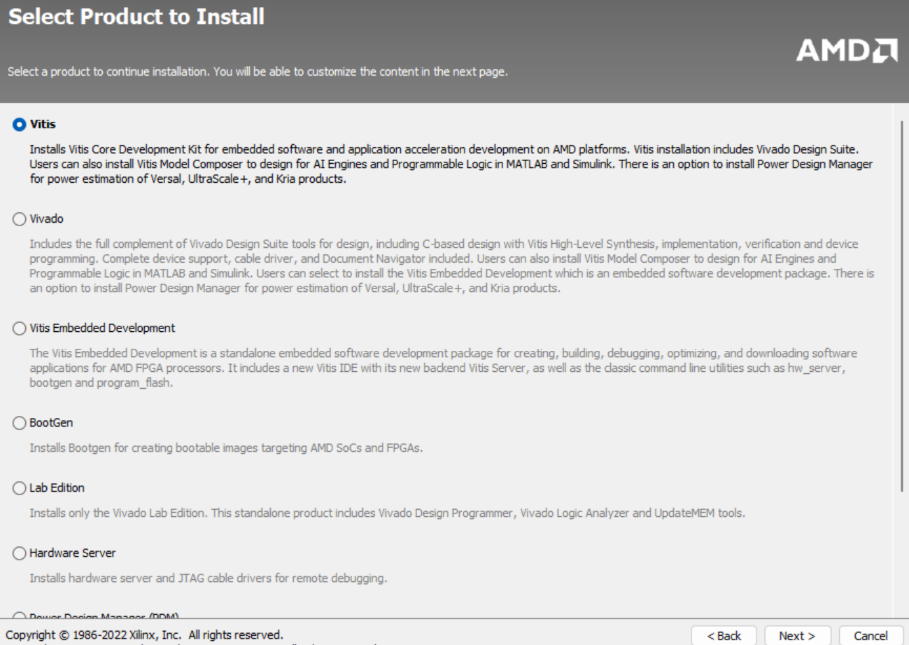
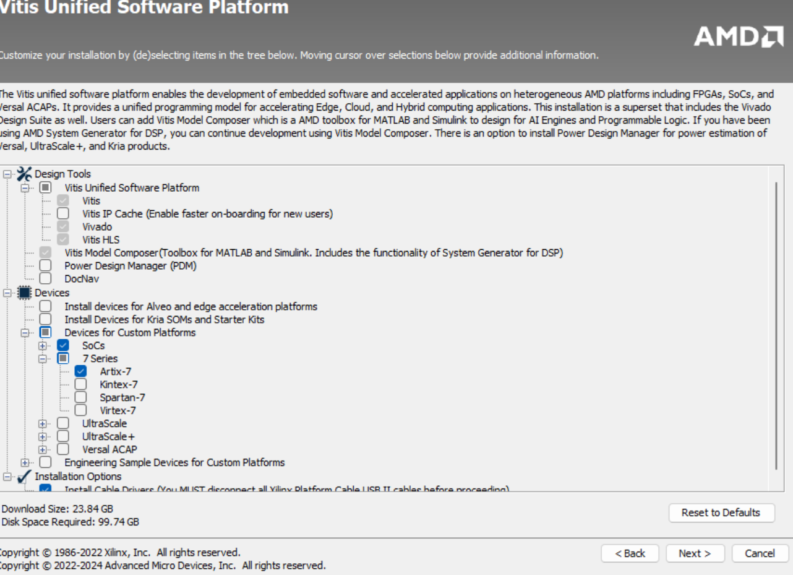

# guitarpedal
FPGA-based Guitar Petal Project for the FPGATORS club at the University of Florida

## Table of Contents

1. [Description](#description)
   - [System Block Design](#system-block-design)
   - [Firmware Design](#firmware-design)
2. [Installation](#installation)

## Description

### System Design 
This project aims to create a guitar pedal using a Zybo Z7 FPGA and Microcontroller. The guitar pedal will produce certain effects (tone, level, distortion, reverb, etc.) depending on which buttons are pressed. The communication protocols that this projet uses are AXI and I2S. A base block design of the project is shown below: 

### Firmware Design
In terms of what will be implemented on the microcontroller, inputs will involve rotary encoders, 5 buttons, AXI, and I2S input. The outputs will be the LCD (using SPI communication protocol), I2S Output, AXI, and controls. Functions will include printing to the LCD, updating the LCD, reading the buttons and encoders, sending control signals to the FPGA with threads, internal logic, calculation of effect weights, and I2S in and out. A diagram describing this is shown below:

## Installation 
This project uses version 2024.1 Vivado and Vitis. 

1. Go to: https://www.xilinx.com/support/download.html and select the AMD Unified Installer for FPGAs & Adaptive SoCs 2024.1 (Linux or Windows depending on your laptop)
2. Log in or create a AMD account 
3. Select either Vitis for the installation shown below. This will install both Vitis and Vivado platforms.

4. When choosing the devices to select, please follow the below image. This will install the 7 Series version we need for the Zybo Z7, any SoCs needed for the microcontroller (might be optional), and cable drivers.

**Note: This may take up a lot of space on your laptop and may take awhile to install**

